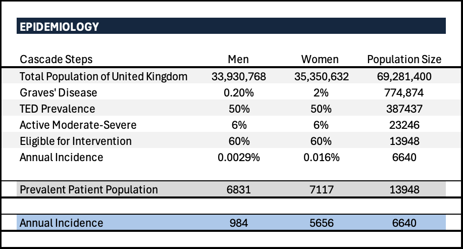
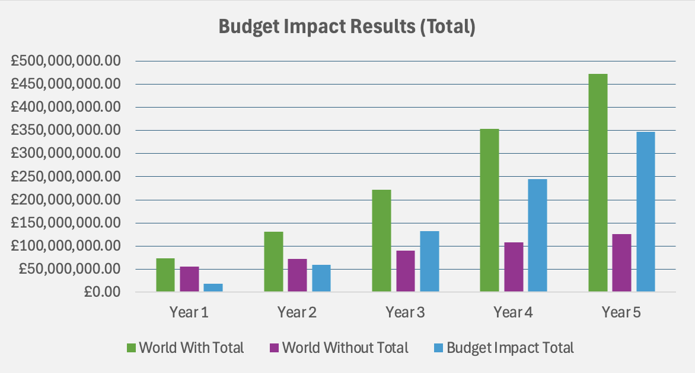
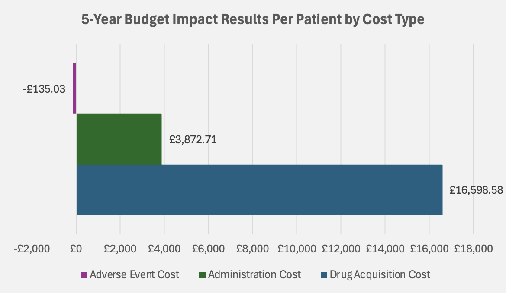

[Home](./) · [CEA](CEA.md) · [BIA](BIA.md) · [Decision Tree](DTM.md)

---

## 2) Budget Impact Analysis (Excel) - Teprotumumab to Treat Thyroid Eye Disease (TED)

This budget impact analysis evaluates the expected budgetary impact of adopting teprotumumab for eligible patients with thyroid eye disease over a 5-year time horizon from a healthcare payer perspective

### Epidemiology and Target Population

*Target population estimation for active moderate–severe TED in the UK, using an epidemiology cascade (population → Graves’ disease → TED prevalence → severity → eligibility), with prevalent and incident patients reported.*

### Budget Impact Results

#### Total Budget Impact

*Annual total costs are shown for the “world with” vs “world without” teprotumumab, alongside the incremental budget impact. This summarises affordability at the payer level over the 5-year horizon.*

#### Market Share and Uptake Assumptions

*Assumed uptake of teprotumumab over five years and displacement of existing treatment options. Uptake assumptions are a key driver of the budget impact trajectory.*

#### Cost Drivers (Per Patient)

*Per-patient cost drivers (drug acquisition, administration, adverse events) illustrating that drug acquisition cost is the primary contributor to incremental budget impact.*

### Model Files
- [Teprotumumab Budget Impact Model](budget-impact-analysis/Teprotumumab%20BIA.xlsx)

*All calculations, parameter inputs, and sensitivity analyses are fully implemented within the Excel model.*

