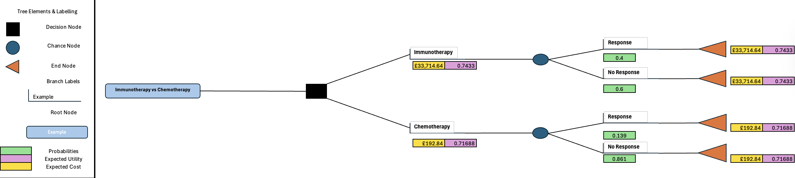
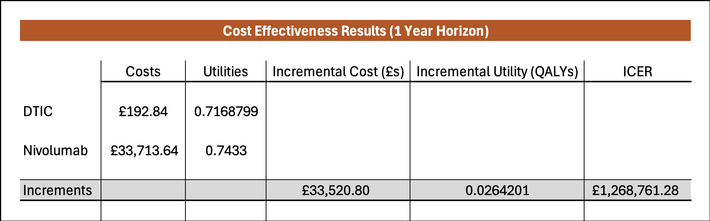
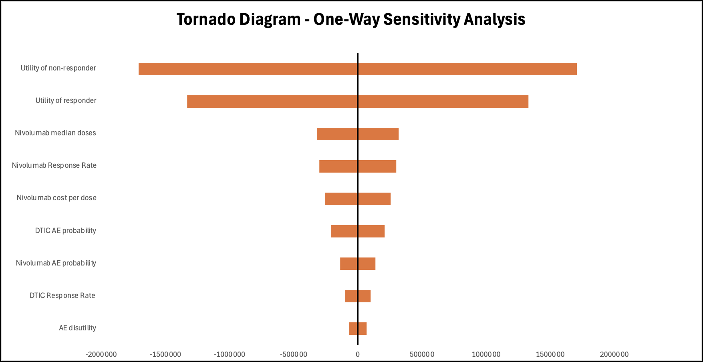

## 3) Decision Tree Model (Excel) 
**Immunotherapy (Nivolumab) vs Chemotherapy (DTIC) for Advanced Melanoma**
- [Decision Tree Model](decision-tree-model/Decision-Tree%20Model.xlsx)

This decision-analytic model evaluates the cost-effectiveness of immunotherapy compared with standard chemotherapy over a 1-year time horizon from a healthcare payer perspective.

---

### Model Structure

*Decision tree comparing immunotherapy (nivolumab) versus chemotherapy (DTIC), incorporating response and non-response pathways with associated costs and health utilities.*

---

### Base-Case Cost-Effectiveness Results (1-Year Horizon)

*In the base-case analysis, immunotherapy is associated with higher costs and modest additional health benefits compared with chemotherapy, resulting in an incremental cost-effectiveness ratio (ICER) of approximately **£1.27 million per QALY gained**.*

---

### One-Way Sensitivity Analysis

*One-way sensitivity analysis demonstrates that model results are most sensitive to health state utility values and the cost of immunotherapy, while adverse event probabilities and disutility have a smaller impact on the ICER.*

---

### Model Files

- [Decision Tree Excel Model](decision-tree-model/Decision-Tree%20Model.xlsx)

*All calculations, parameter inputs, and sensitivity analyses are fully implemented within the Excel model.*

---

⬅️ [Previous: Budget Impact Analysis](bia) | 🏠 [Home](./)
